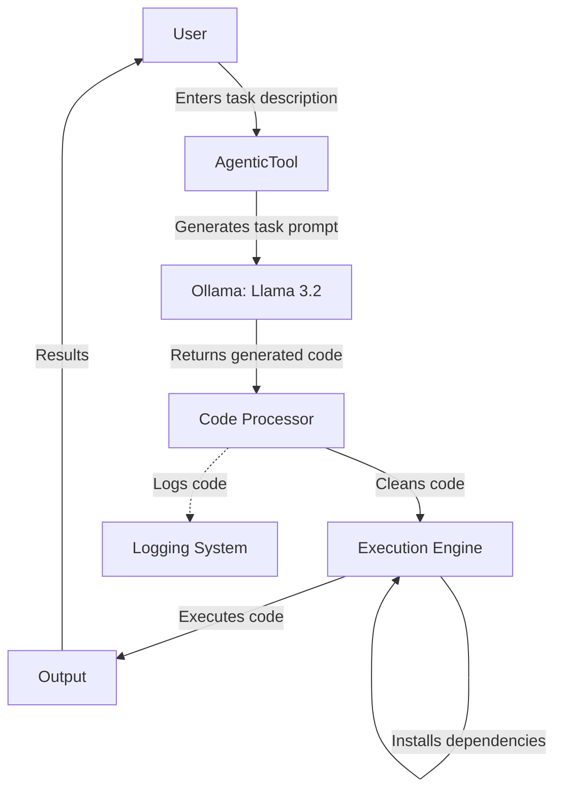
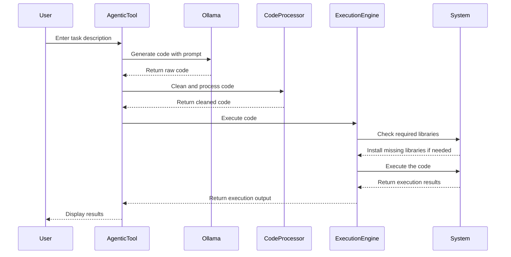
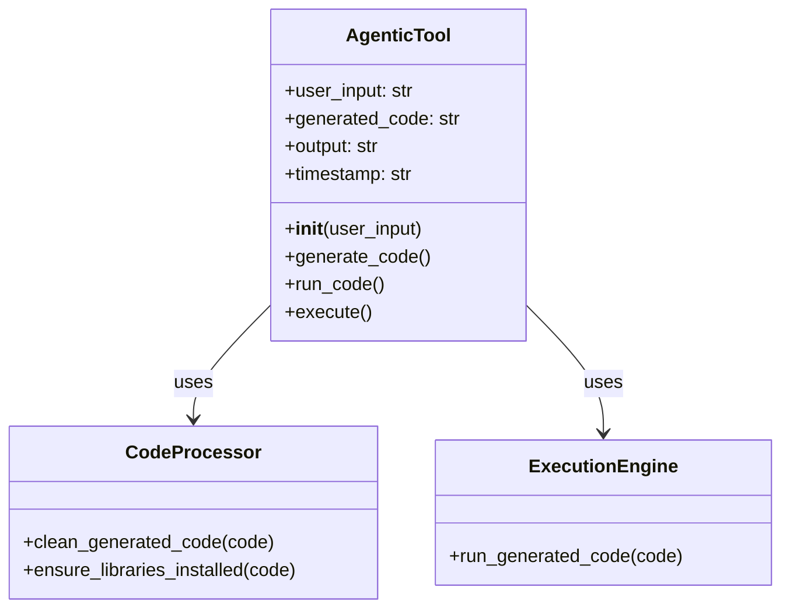

# Coding Agent - System Design Document

## 1. System Architecture

The Coding Agent is an AI-powered system that generates and executes Python code based on natural language descriptions. It leverages the Llama 3.2 model through Ollama to generate code, then processes and executes it safely.



## 2. Process Flow



## 3. Component Details

### 3.1 Code Generation and Processing



## 4. Setup Guide

### 4.1 Prerequisites

- Python 3.10+ installed
- [Ollama](https://ollama.ai/) installed with Llama 3.2 model
- Git (optional)

### 4.2 Setting up the Environment

```bash
# Create a directory for the project
mkdir -p /C:/AI/codingAgent
cd /C:/AI/codingAgent

# Create and activate a virtual environment
python -m venv coder_env
source coder_env/Scripts/activate  # On Windows: coder_env\Scripts\activate

# Install required libraries
pip install requests beautifulsoup4 matplotlib numpy pillow
```

### 4.3 Essential Libraries

| Library | Purpose |
|---------|---------|
| subprocess | For running external commands |
| logging | For logging code generation and execution |
| webbrowser | For opening web browsers |
| requests | For making HTTP requests |
| beautifulsoup4 | For web scraping tasks |
| matplotlib | For data visualization |
| numpy | For numerical computations |
| pillow | For image processing |

### 4.4 Project Structure

```
/C:/AI/codingAgent/
├── coder_env/              # Virtual environment
├── coder.py                # Code generation and execution core
├── agentic_tool.py         # Main interface for the agent
├── generated_code.py       # Latest generated code
├── generated_code.log      # Log file for code execution
├── agent.log               # Log file for agent actions
├── logs/                   # Directory for detailed logs
│   ├── raw_code_*.py       # Raw generated code logs
│   └── cleaned_code_*.py   # Cleaned code logs
└── docs/                   # Documentation
    └── design_document.md  # This design document
```

## 5. Usage Guide

### 5.1 Basic Usage

```bash
# Activate the virtual environment
cd /C:/AI/codingAgent
source coder_env/Scripts/activate  # On Windows: coder_env\Scripts\activate

# Run the agent
python agentic_tool.py

# Or with a command line argument
python agentic_tool.py "calculate the factorial of 10"
```

### 5.2 Example Tasks

Here are some example tasks you can give to the agent:

1. "browse to https://github.com" - Open GitHub in a web browser
2. "calculate the factorial of 10" - Calculate and display a factorial
3. "create a fractal tree using turtle graphics" - Generate visual art
4. "scrape the top headlines from BBC" - Web scraping task
5. "create a simple calculator with GUI" - Create a basic application

## 6. Implementation Notes

- The system uses pattern matching for specific tasks like browsing URLs
- All generated code is logged for audit and debugging purposes
- External libraries required by generated code are dynamically installed
- Special handling is provided for web browser and terminal commands
- The agent runs in a controlled environment with restrictions on potentially harmful operations
